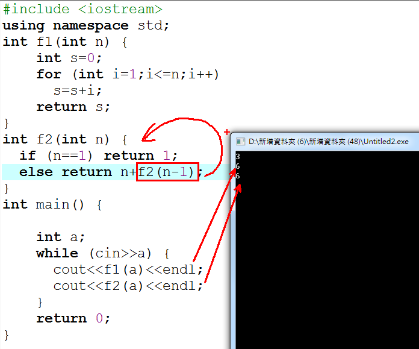
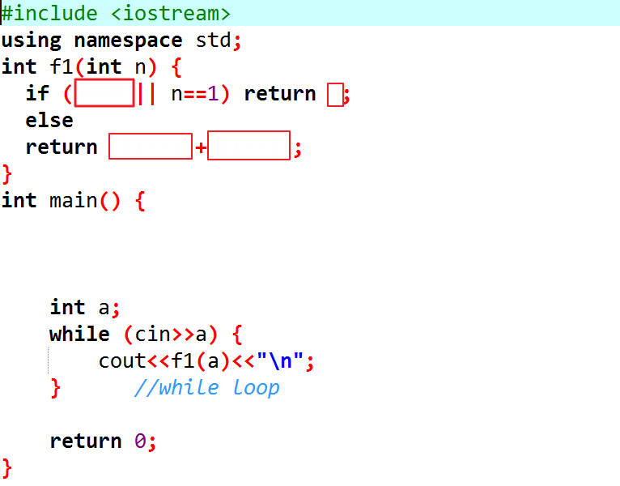

** 遞迴**

**內容 ：**

**1+2+3+...+n之和可以使用for迴圈(f1)，或者遞迴函式(f2)。如下所示**

在f2(n)函式裡，呼叫f2(n-1)，這種函式自身呼叫的方式稱為遞迴。

注意：遞迴必須要有結束的條件，否則會陷入無窮遞迴。以這個例子來說n==1時傳回1，就不必再往下呼叫。

請仿照上例使用遞迴寫出費伯納西數列

**F~0~ = 0\
F~1~ = 1\
F~n~ = F~n-1~ + F~n-2~**

**0 1 1 2 3 5 8 11 ...**

**輸入說明 ：**

n

**輸出說明 ：**

F(n)

**範例輸入
：**

**1**

**3**

**5**

**範例輸出 ：**

1

2

5

\#include \<iostream\>

using namespace std;

int main() {

int a;

while (cin\>\>a) {

} //while loop

return 0;

}
