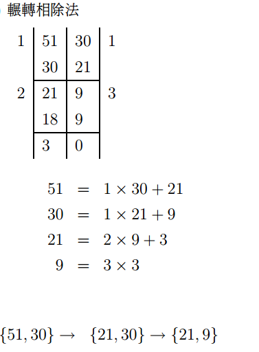
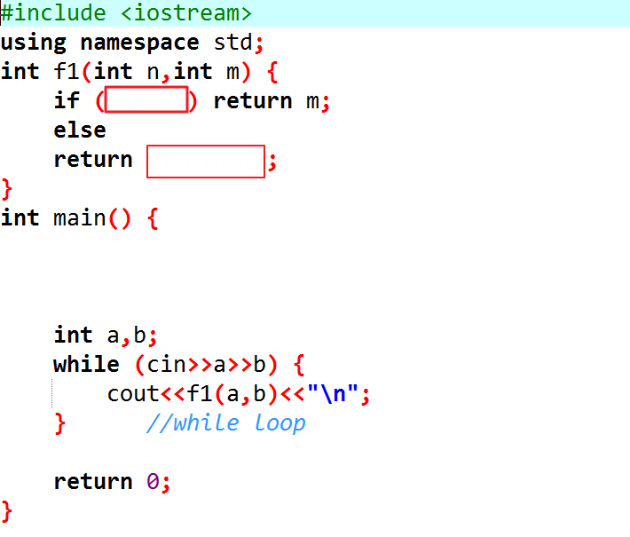

**最大公因數(GCD)**

**內容 ：**

給定兩個數字，請得出它們的最大公因數

**輸入說明 ：**

兩個整數 大於 0, 小於 2^31^

**輸出說明 ：**

最大公因數為一整數

**範例輸入
：**

12 15

**範例輸出 ：**

3

\#include \<iostream\>

using namespace std;

int main() {

int a,b;

while (cin\>\>a\>\>b) {

} //while loop

return 0;

}

