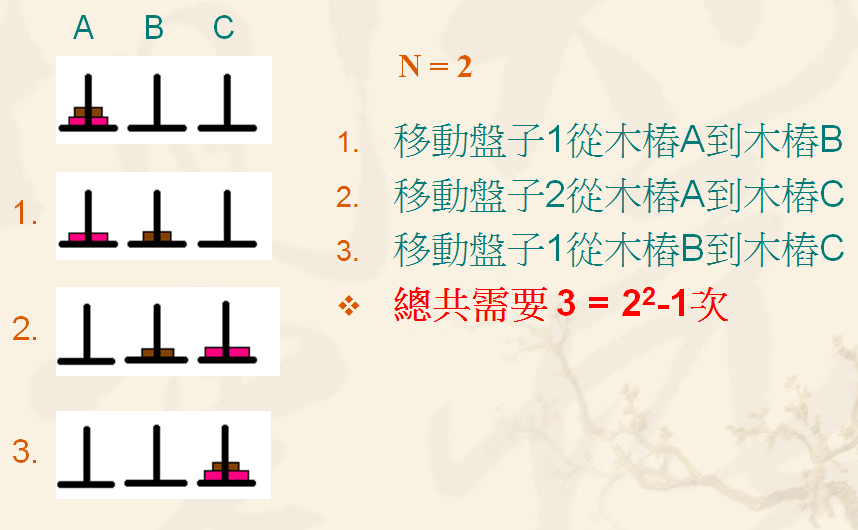
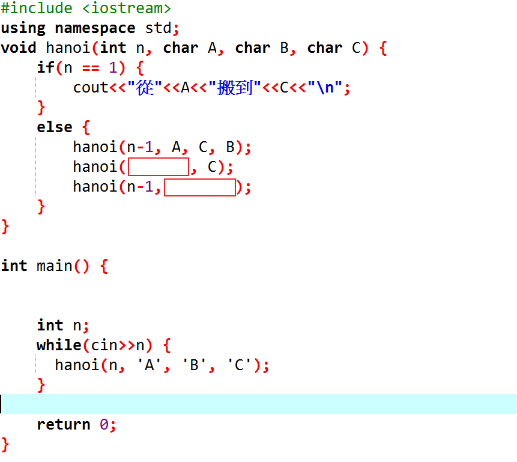

**河內塔**

傳說某間寺院有三根柱子，上串64個金盤。寺院裡的僧侶依照一個古老的預言，以下述規則移動這些盤子；

三根杆子A，B，C。A桿上有N個(N\>1)穿孔圓盤，盤的尺寸由下到上依次變小。要求按下列規則將所有圓盤移至C桿：

1.  每次只能移動一個圓盤；

2.  大盤不能疊在小盤上面。

預言說當這些盤子移動完畢，世界就會滅亡。若傳說屬實，僧侶們需要2^64^ −
1步才能完成這個任務；若他們每秒可完成一個盤子的移動，就需要5846億年才能完成。整個宇宙現在也不過137億年。

**輸入說明 ：**

N個盤子，N\<64

**輸出說明 ：**

搬移步驟

**範例輸入
：**

**2**

**範例輸出 ：**

從A搬到B

從A搬到C

從B搬到C

\#include \<iostream\>

using namespace std;

void hanoi(int n, char A, char B, char C) {

if(n == ??) {

??

}

else {

??

}

}

int main() {

int n;

while(cin\>\>n) {

hanoi(n, \'A\', \'B\', \'C\');

}

return 0;

}

