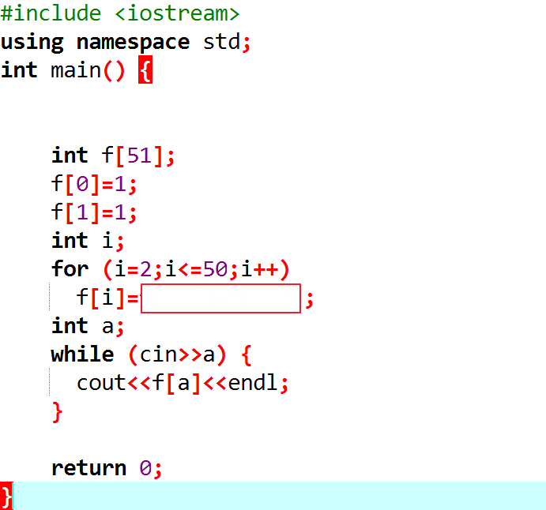

**爬樓梯**

眼前有五階樓梯，每次可踏上一階或踏上兩階，那麼爬完五階共有幾種踏法？例如
(1,1,1,1,1) 是其中一種踏法， (1,2,1,1) 是另一種不同的踏法。

**輸入說明 ：**

N層階梯，N\<30

**輸出說明 ：**

走法數

**範例輸入
：**

**1**

**2**

**範例輸出 ：**

1

2

\#include \<iostream\>

using namespace std;

int main() {

int n;

while(cin\>\>n) {

}

return 0;

}

