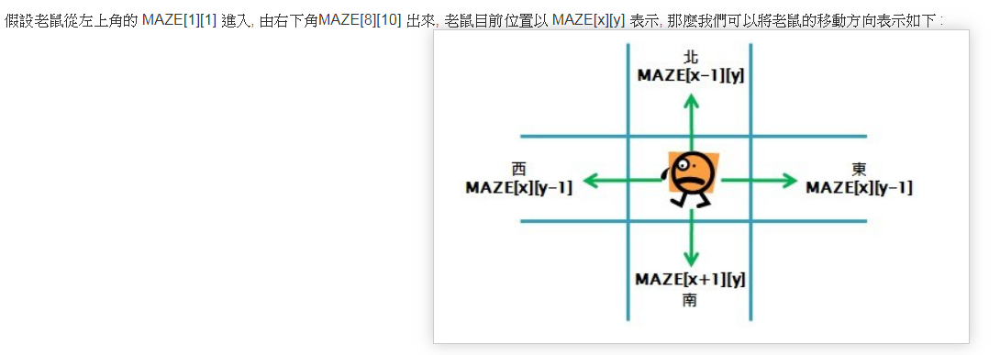
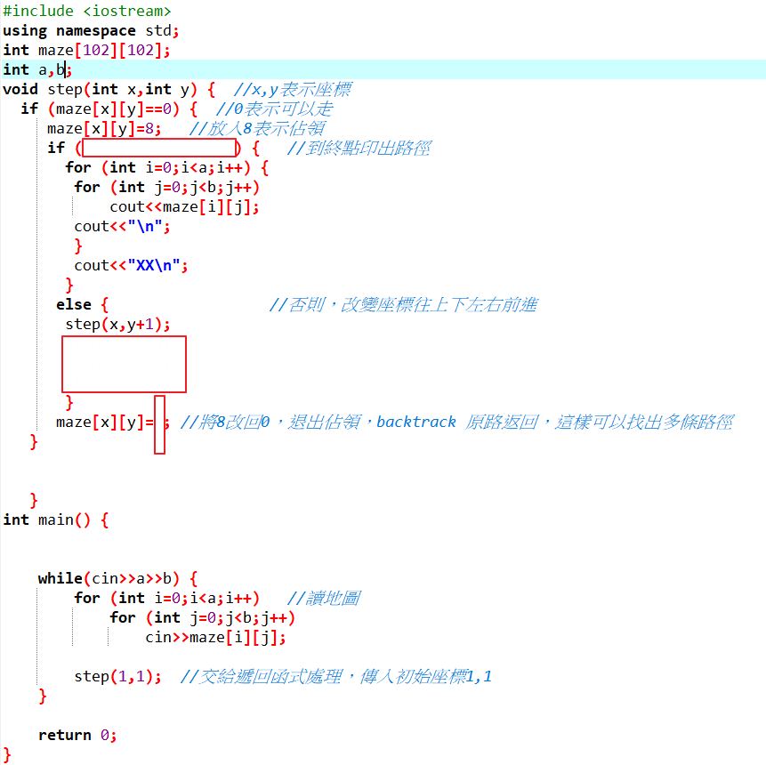

**老鼠走迷宮(Backtracking演算法與其應用)**

老鼠走迷宮是堆疊在實際應用上一個很好的例子. 在一個實驗中,
老鼠被放進一個迷宮裡, 當老鼠走錯路時, 就會重走一次並把走過的路記起來,
避免走重複的路, 就這樣直到找到出口為止. 另外在迷宮移動尋找出口時,
電腦還必須判斷下一步該往哪一個方向移動, 此外還必須記錄能夠走的迷宮路徑,
如此才可以在迷宮走到死胡同時, 可以回頭來搜尋其它路徑. 在迷宮行進,
必須遵守以下三個原則 :

\* 一次只能走一格.\
\* 遇到牆無法往前走時,則退回一步找找看是否有其他的路可以走.\
\* 走過的路不會再走第二次.

**範例輸入
：**
<pre>
+---------------+--------------------+
| 8 7           | 迷宮大小           |
|               |                    |
| 1 1 1 1 1 1 1 | 1為牆壁，0為可通行 |
|               |                    |
| 1 0 0 0 0 0 1 |                    |
|               |                    |
| 1 1 0 1 1 0 1 |                    |
|               |                    |
| 1 1 0 1 1 0 1 |                    |
|               |                    |
| 1 1 0 0 0 1 1 |                    |
|               |                    |
| 1 0 0 1 0 1 1 |                    |
|               |                    |
| 1 1 1 1 0 0 1 |                    |
|               |                    |
| 1 1 1 1 1 1 1 |                    |
+---------------+--------------------+
</pre>
**範例輸出 ：**
<pre>
+---------+------------------------------+
| 1111111 | 以8標出路徑                  |
|         |                              |
| 1880001 | 最後以XX做結尾，區隔每組解答 |
|         |                              |
| 1181101 |                              |
|         |                              |
| 1181101 |                              |
|         |                              |
| 1188811 |                              |
|         |                              |
| 1001811 |                              |
|         |                              |
| 1111881 |                              |
|         |                              |
| 1111111 |                              |
|         |                              |
| XX      |                              |
+---------+------------------------------+
</pre>
\#include \<iostream\>

using namespace std;

int maze\[102\]\[102\];

int a,b;

void step(int x,int y) { //x,y表示座標

}

int main() {

return 0;

}
